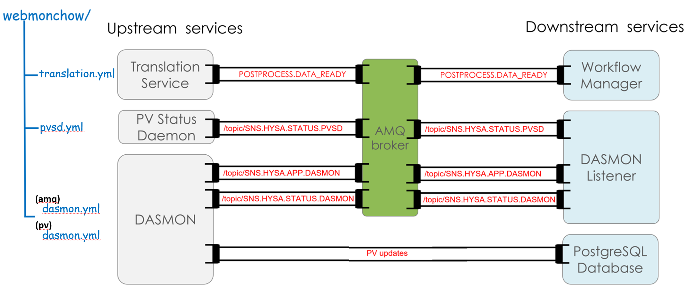
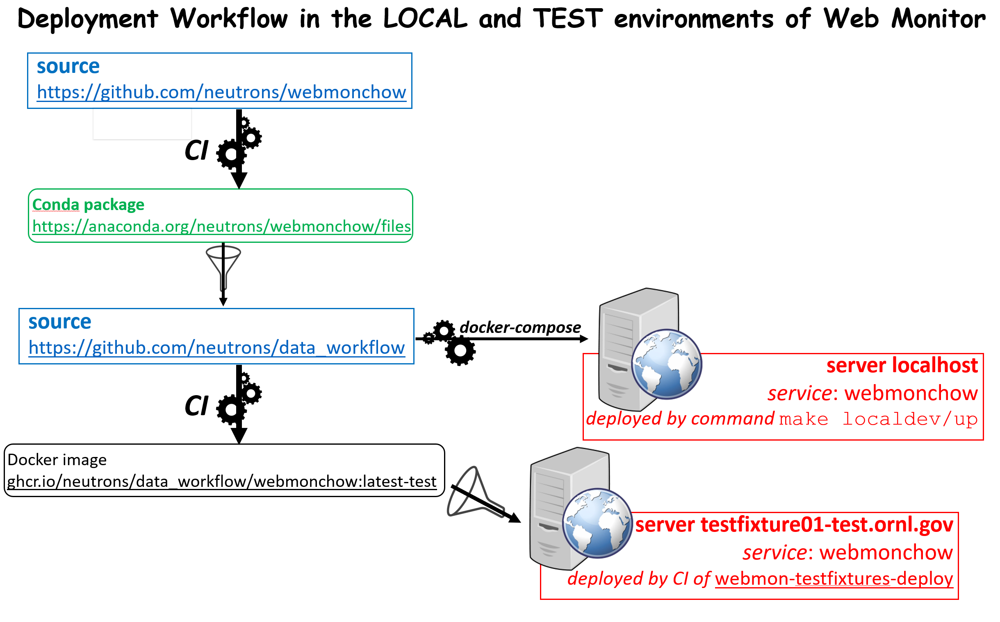
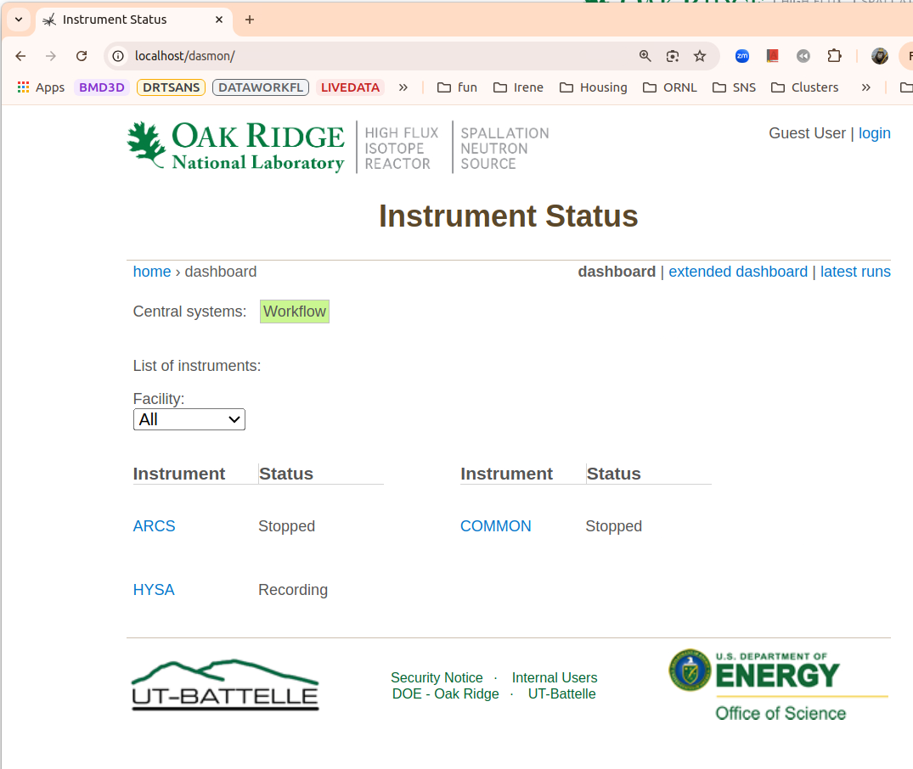

.. _User:

User Documentation
==================

.. contents::
   :local:
   :depth: 1

Webmonchow mimics three services (translation, pvsd, dasmon) that generate AMQ messages
and process variables (PV) updates.
These services provide the feed to three of the components spawned by the
`data_workflow <https://github.com/neutrons/data_workflow>`_ package, namely the
*workflow-manager*, the *dasmon-listener*, and the *PostrgreSQL database*.

Deployments
-----------
Webmonchow is deployed as a service in a Docker container,
either in the local or test environments of the Web Monitor application.

Entry Points
------------
After installation, two executable scripts are available from the command line:

.. code-block:: bash

   $> broadcast_amq --user --password --broker --content-files
   $> broadcast_pv --user --password --host --port --database-name --pv-files

Broadcast AMQ messages
----------------------
Command `broadcast_amq` will connect to the default AMQ broker at `localhost:61613`.
If the broker is not running, `broadcast_amq` will attempt to reconnect every 5 seconds indefinitely
or until a prescribed number of attempts is reached.
These settings can be changed by via the command line options (see `broadcast_amq --help`)

Messages are generated from one or more content `json` files.
The files contain  messages of different types,
some of them being sent regularly with a frequency (unit of seconds) denoting the time between consecutive messages.
If the frequency is 0 then the message is only sent once, at the start.

The default content files:

- `amq dasmon.json <https://github.com/neutrons/webmonchow/blob/next/src/webmonchow/amq/services/dasmon.json>`_:
  heartbeat message for each instrument and message summarizing the last run for each instrument.
- `pvsd.json <https://github.com/neutrons/webmonchow/blob/next/src/webmonchow/amq/services/pvsd.json>`_:
  heartbeat messages from the process variable service daemon (PVSD).
- `translation.json <https://github.com/neutrons/webmonchow/blob/next/src/webmonchow/amq/services/translation.json>`_:
  messages indicating that certain runs are ready for auto-reduction (post-processing).
  In the local deployment of `data_workflow`, these messages are sent to the AMQ broker
  and will remain there until picked by the `autoreducer` service.

Message format
++++++++++++++
An example of the input `json` file is:

.. code-block:: json

   {
       "POSTPROCESS.DATA_READY": [
       {"frequency": 0,
        "message": {"instrument": "HYSA",
                "ipts": "IPTS-12345",
                "run_number": "321",
                "facility": "SNS",
                "data_file": "/bin/true"}},
       {"frequency": 0,
        "message": {"instrument": "HYSA",
                "ipts": "IPTS-12345",
                "run_number": "322",
                "facility": "SNS",
                "data_file": "/bin/true"}},
       {"frequency": 0,
        "message": {"instrument": "HYSA",
                "ipts": "IPTS-12345",
                "run_number": "323",
                "facility": "SNS",
                "data_file": "/bin/true"}}
       ],
       "/topic/SNS.HYSA.STATUS.DASMON": [
       {"frequency": 0.2,
        "message": {"src_name": "dasmon",
                "status": "0"}}
       ],
       "/topic/SNS.HYSA.STATUS.PVSD": [
       {"frequency": 0.2,
        "message": {"src_name": "pvstreamer",
                "status": "0"}}
       ],
       "/topic/SNS.HYSA.APP.DASMON": [
       {"frequency": 0.1,
        "message":
        {"monitors": {"1": 100, "2": 2000},
         "count_rate": 9000,
         "run_number": 324,
         "proposal_id": 12345,
         "run_title": "This is the run title",
         "recording": true}
       }
       ]
   }

Broadcast PV updates
--------------------
Command `broadcast_pv` will connect to the default postgresql database `localhost:5432`.
If the database is not running, `broadcast_pv` will attempt to reconnect every 5 seconds indefinitely
or until a prescribed number of attempts is reached.
Once connected, `broadcast_pv` will send the PV updates defined in file
`PV dasmon.json <https://github.com/neutrons/webmonchow/blob/next/src/webmonchow/pv/services/dasmon.json>`_.

These settings can be changed by via the command line options (see `broadcast_pv --help`)
or via the environment variables defining the database settings:

.. code-block:: bash

   DATABASE_NAME
   DATABASE_USER
   DATABASE_PASS
   DATABASE_HOST
   DATABASE_PORT

These environment variables will be defined when the `data_workflow` package is deployed
in the local environment. (see Section `Running as a Docker Service` below).

The PVs are generated from an input `json` file.
The file defines different PVs, each with a frequency (unit of seconds) denoting the time interval
between updates for that particular PV.
If the frequency is 0 then the PV is only sent once, at the start.
Each PV also has a string defining a function that will be evaluated to generate the value of the PV.
The `function(x)` is evaluated with `x` being the number of seconds since `broadcast_pv` started.

PVs file format
+++++++++++++++

An example of the input `json` file is:

.. code-block:: json

    {
        "pvUpdate": [
            {
                "frequency": 0.1,
                "instrument": "HYSA",
                "name": "sinPV",
                "function": "100*math.sin({x}/2000)"
            },
            {
                "frequency": 0.2,
                "instrument": "HYSA",
                "name": "sawtoothPV",
                "function": "{x}%60"
            }
        ],
        "pvStringUpdate": [
            {
                "frequency": 0.01,
                "instrument": "HYSA",
                "name": "xString",
                "function": "'x = {x} seconds'"
            }
        ]
    }

Installation
------------
With conda:

.. code-block:: bash

   $> conda activate my-environment
   (my-environment)$> conda install -c neutrons webmonchow  # install latest Production version

With pip from the source repository:

.. code-block:: bash

   $> pip install git+https://github.com/neutrons/webmonchow.git@v1.0.0#egg=webmonchow  # install tag v1.0.0
   $> pip install git+https://github.com/neutrons/webmonchow.git@next#egg=webmonchow  # install tip of development

Running as a Docker Service
---------------------------

Webmonchow is deployed as a service in a Docker container,
alongside a local deployment of the `data_workflow <https://github.com/neutrons/data_workflow>`_ package.

The Dockerfile:

.. code-block:: Dockerfile

   FROM continuumio/miniconda3:23.3.1-0
   RUN conda install --yes -n base conda-libmamba-solver
   RUN conda install --yes --solver=libmamba -n base -c conda-forge -c neutrons postgresql=14 webmonchow=1.0.0
   CMD ["sh", "-c", "broadcast_pv & broadcast_amq --broker \"activemq:61613\" & wait"]

If you are testing new features of webmonchow not yet released,
you can modify the Dockerfile to install the package from the feature branch of your source repository:

.. code-block:: Dockerfile

   FROM continuumio/miniconda3:23.3.1-0
   RUN conda install --yes -n base conda-libmamba-solver
   RUN conda install --yes --solver=libmamba -n base -c conda-forge postgresql=14
   RUN python -m pip install git+https://github.com/neutrons/webmonchow.git@MYFEATUREBRANCH#egg=webmonchow
   CMD ["sh", "-c", "broadcast_pv & broadcast_amq --broker \"activemq:61613\" & wait"]

Service `webmonchow` needs to be included in the
`docker-compose.yml <https://github.com/neutrons/data_workflow/blob/next/docker-compose.yml>`_
file of the `data_workflow` package:

.. code-block:: yaml

   webmonchow:
     restart: always
     build:
       context: .
       dockerfile: Dockerfile.webmonchow
     env_file:
       - .env
     depends_on:
       db:
         condition: service_healthy
       webmon:
         condition: service_healthy
       activemq:
         condition: service_healthy

Adding a new Instrument
-----------------------

When the `data_workflow <https://github.com/neutrons/data_workflow>`_ is deployed locally
alongside running `webmonchow` as a Docker service,
and the application is served at `http://localhost`, the welcome page will look something like this:

The Web Monitor application shows entries only for instruments with AMQ messages defined in
`amq dasmon.json <https://github.com/neutrons/webmonchow/blob/next/src/webmonchow/amq/services/dasmon.json>`_.
Similarly, it will show PVs (e.g. `http://localhost/pvmon/arcs/`) only for instruments with PVs defined in
`PV dasmon.json <https://github.com/neutrons/webmonchow/blob/next/src/webmonchow/pv/services/dasmon.json>`_.
If you want additional instrument to show, you need to add content to these files.
Also, if you want to signal that some runs for the instrument are ready for post-processing,
you need to add them in
`translation.json <https://github.com/neutrons/webmonchow/blob/next/src/webmonchow/amq/services/translation.json>`_
